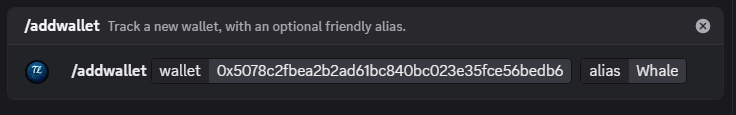
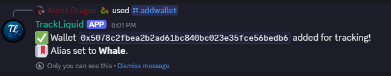
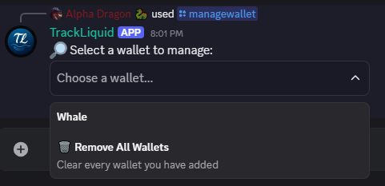
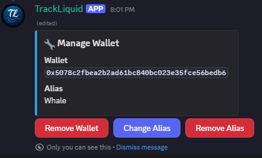
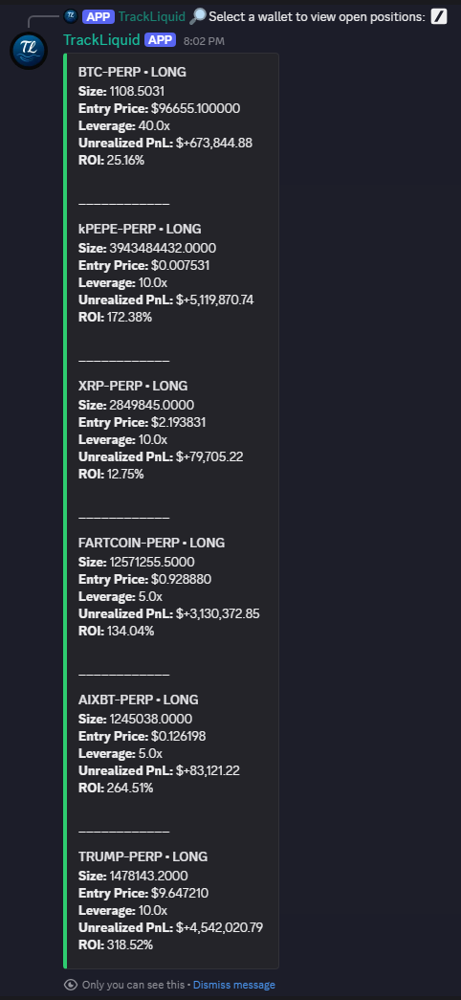
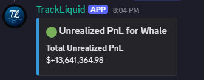
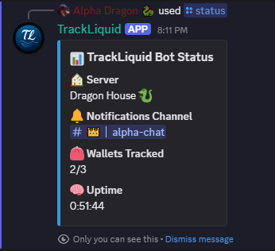

# 📡 TrackLiquid — Hyperliquid Wallet Tracker

TrackLiquid brings real-time Hyperliquid perp position alerts straight into your Discord server.

---

## 🚀 Quick Start

1. **Invite TrackLiquid**  
   Click your personal invite link and choose a server.

2. **Pick Your Alerts Channel**  
   `/setchannel` → select the channel where alerts should post.

3. **Add Wallets to Track (up to 3)**  
   `/addwallet 0x5078c2fbea2...bedb6 [Whale]`  
   *Optional alias helps you read alerts at a glance.*

4. **View Unrealized PnL**  
   `/unrealized` → select a tracked wallet to see its current unrealized P&L.

---

## ⚙️ Core Commands

| Command           | Description                                                                                   |
|-------------------|-----------------------------------------------------------------------------------------------|
| `/help`           | Show a quick reminder of all available commands.                                              |
| `/addwallet`      | Track a new wallet (with an optional alias). Use up to 3 wallets per server.                  |
| `/listwallets`    | Quickly list your tracked wallets and aliases.                                                |
| `/managewallet`   | View, rename, or remove any tracked wallet (includes “Remove All”).                           |
| `/openpositions`  | Show current open PERP positions for a tracked wallet (size, entry price, leverage, P&L).    |
| `/unrealized`     | Show unrealized PnL for a tracked wallet.                                                     |
| `/setchannel`     | Choose which channel receives perp notifications (leave blank to clear).                      |
| `/status`         | Display bot uptime and how many wallets you’re tracking (e.g. `2/3`).                         |

---

## 💡 Examples

- **Add a wallet with an (optional) alias**  
  `/addwallet 0xABC...123 MyTradingWallet`  
  

    
    
  

- **List & manage wallets**  
  `/managewallet` → choose “MyTradingWallet” → rename, remove, or clear all.  
  

    
    
  

- **Check open positions**  
  `/openpositions` → select your wallet → see entry price, size, leverage, PnL.  
  

    
  

- **Check Unrealized PnL**  
  `/unrealized` → select your wallet → shows current unrealized profit & loss.  
  

    
  

- **View bot status**  
  `/status` → shows uptime and number of tracked wallets (e.g. `2/3`).  
  

    
  

---

## 🤝 Support

If you hit a snag or have a feature request, join our Support Server:  
👉 https://discord.gg/ZwUmxk2Y3B

---

© 2025 AlphaDragon50 · [MIT License](./LICENSE.md)  
